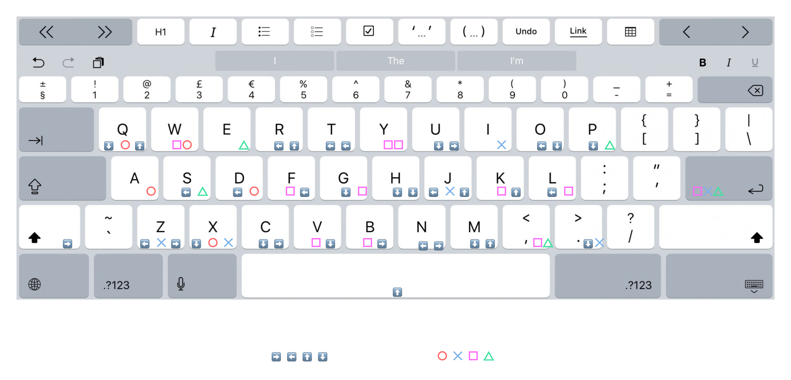
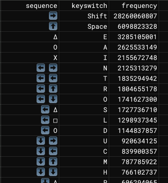

# Huffman-Arpeggio Layout

This repository contains an illustrative experiment demonstrating the concept of a Huffman-Arpeggio keyboard layout. The idea is to use Huffman coding principles to create an efficient, sequence-based input method that can be adapted to various devices, from simple sip-and-puff switches to complex VR controllers and neural interfaces.

### Visualizations





## Introduction

The idea is to have a virtual keyboard with the familiar qwerty layout, which you can "actuate" by pressing corresponding arpeggios (the sequential version of chords) on e.g. hardware buttons (in this example, on a playstation controller).

The fact that it's an **N-ary** tree makes it possible to use any number of switches, from sip and puff devices to actual hardware qwerty keyboards. In the latter case, you could make it so that you never have to leave the homerow!

And with a bit of gamified **spaced repetition** training (as a separate learning UI, or in-context, prompting you to repeat a sequence you performed slowly multiple times until performance improves before actually outputting the character) you can gain muscle memory and type pretty fast.

Also useful for TV remotes, VR controllers (including **EMG wristbands** where you can detect 1D "trigger" actions for each of the fingers; no spatial component, no need to flail arms around to hit a virtual keyboard with virtual hands, they can be by your side while standing, resting on your lap, anywhere—**"low-calorie movements"**, as Meta Reality Labs puts it).

Even **neural interfaces** (Neuralink is currently testing a text entry method where the user moves the mouse with their mind and traces letters on screen for them to be detected 🤦‍♂️. Mouse calligraphy is slow and overkill when all you need is a few discretely-detectable mental signals, at the limit even 1—the equivalent of an eye-blink, where focus moves automatically on screen between 2 different buttons until users "clicks" one—possibly enabling even non-invasive EEG BCI to have good performance).

And the fact it's an N-ary **Huffman** tree makes it the fewest expected physical "keystrokes" you need to make (here from wikipedia char frequencies, but can be from userbase, or optimized for different languages/uses).

And this is the most naive version. There are all kinds of optimizations you can make by taking into account different **actuator costs** (e.g. pinky finger costs more than index or thumb), different inter-actuator costs (alternating buttons on different hands is faster/lower effort; alternating fingers is cheaper than same finger twice), motor learning / muscle memory acquisition costs, etc. At the limit you can use reinforcement learning on performance datasets and let it reverse engineer human bioeconomics.

### Key Features

- **Optimized for Efficiency**: Uses Huffman coding to reduce the number of keystrokes for frequent characters.
- **Accessibility-Friendly**: Can be adapted for use with various devices, including sip-and-puff systems and neural interfaces.
- **Versatile**: Suitable for different contexts, from TV remotes and VR controllers to custom keyboards and EMG wristbands.

## Experiment Contents

This repository is not a finished product but serves as an illustration of the Huffman-Arpeggio layout concept. It includes code to generate a Huffman tree and map sequences to characters based on their frequency, along with example visualizations.

## Usage

To run the script and generate the encoding map, follow these steps:

1. **Install dependencies**: Ensure you have `pandas`. You can use Poetry to manage dependencies:
   ```sh
   poetry install

2. **Run the script**:

   ```sh
   poetry run python huffman-arpeggio.py Corrected_Character_Frequencies_with_Keyswitches.csv output.csv
   ```

## Potential Improvements

While this repository contains only a basic introduction and illustration, the Huffman-Arpeggio layout concept can be taken much further:

- Add predictive typing, optimize arpeggio length based on next-token probabilities
- Automate and optimize keybinding generation for command palettes and keyboard shortcuts
- Generalize from text entry and commands/actions all the way to tactile interactive end-user programming
- Generalize predictive typing to predictive doing/coding
- [Fleet Cyborgism](https://www.youtube.com/watch?v=Knrh-HWUVoo)

That's the wider vision for the [Keykapp](https://keykapp.com) architecture that I invite you to explore and apply to your own software.

Feedback welcome!

### License

MIT License